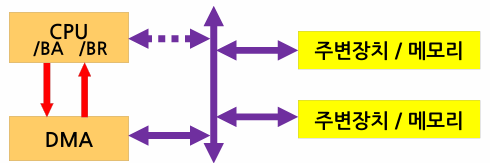
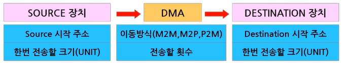
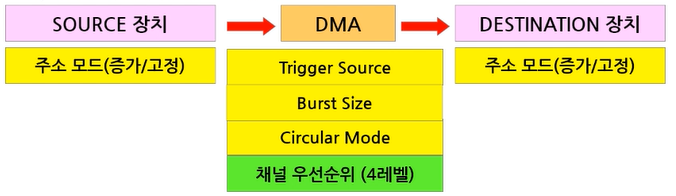

___
- <b>Direct Memory Access</b>
 

- CPU 관점에서 DMA는 주변장치 -> DMA도 CPU의 제어로 동작

___

### 과정
 

 

- <b>1</b>: `BR (Bus Request)`: DMA->CPU 메모리 버스 제어권 요구
- <b>2</b>: `BA (Bus Ack`: CPU->DMA 버스 제어권 양보
- <b>3</b>: Transfer: DMA가 버스를 이용하여 메모리간 데이터 이동 (<b><u>이때, 1 UNIT만 이동</u></b>)
- <b>4</b>: 제어권 반납: 1 UNIT 이동 후 다시 CPU에게 제어권 반납
- <b>5</b>: 정해진 크기의 메모리 이동을 마칠 때까지 <b>1~4</b> 과정 반복
 

- DMA가 버스 사용 (<b>Cycle Steal</b>)시 CPU는 버스 사용 불가
- <b>DMA가 작업을 하는 동안 CPU는 다른 작업에 집중할 수 있음</b>
- 최근에는 DMA에서 행렬 등 연산도 수행 -> 간단한 CPU 역할
 

___
### DMA 설정
 

- <b>최소한의 동작을 위한 설정 정보</b>
 

 

 

 - M2M (mem to mem), M2P (mem to 주변장치), P2M (주변장치 to mem), <i>P2P</i>

 

- <b>다양한 DMA 활용을 위해서는 다음 설정이 추가적으로 필요</b>

 
 
 

___
#### 주소 증가 모드
 

- <b>증가 모드 (INC)</b>: SRC, DEST가 동일한 크기로 데이터 이동
	- M2M 등 일반적인 데이터 이동에 사용하는 모드

 

- <b>고정 모드 (FIX)</b>: SRC나 DEST가 데이터 이동 시 주소를 고정시켜서 사용

 

___
#### Trigger Source
 

- DMA에게 unit transfer trigger를 주는 장치 (전송 시점 지정)
- DMA에 전송 정보를 모두 설정한 후 DMA 동작을 Start 시키는 동작 필요
- P2M, M2P의 경우 Peripheral의 동작이 준비되어야 1 unit transfer 가능 
 

- <b>SW 트리거</b>: 프로그램에서 DMA Start
- <b>HW 트리거</b>: ex) Source가 UART 수신일 경우? UART에 데이터가 들어와야 DMA가 동작 가능
 

___
#### ISR
 

- 인터럽트가 필수적 -> 작업 시작, 종료 알림

