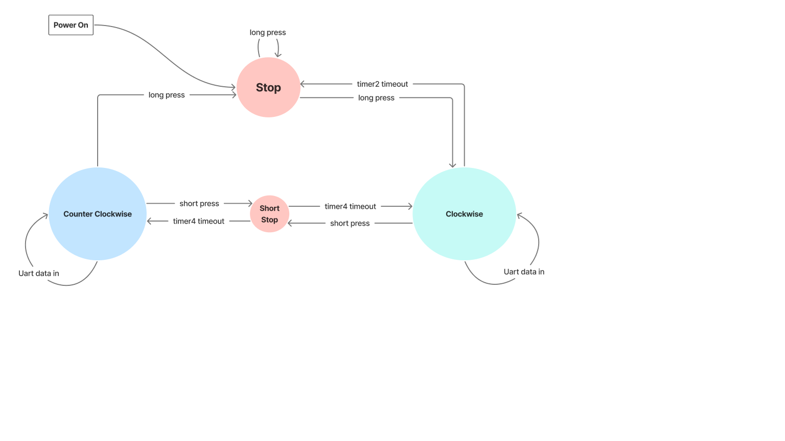

___

## Finite State Machine
 
- <b><u>유한 상태 머신</u></b>
 
- <b>핵심 요소</b>
	- <i>상태 (state)</i> : 시스템이 갖는 모든 상황
	- <i>전이 (transition)</i>: 조건 충족 시 상태 변화
	- <i>출력 (output)</i>: 각 상태에서 보낼 신호
  

## Moore FSM
 

- 출력이 오직 <b>현재 상태</b>에만 의존
 

## Mealy FSM
 

- 출력이 <b>현재 상태 + 입력</b>에 따라 변화

___

## 예제
 

- <b>이벤트</b>
	- key pressed (short<200msec, long)
	- key released
	- TIM start
	- TIM expired
 

- <b>상태</b>
	- STOP
	- Clockwise
	- Reverse-Clockwise
 

