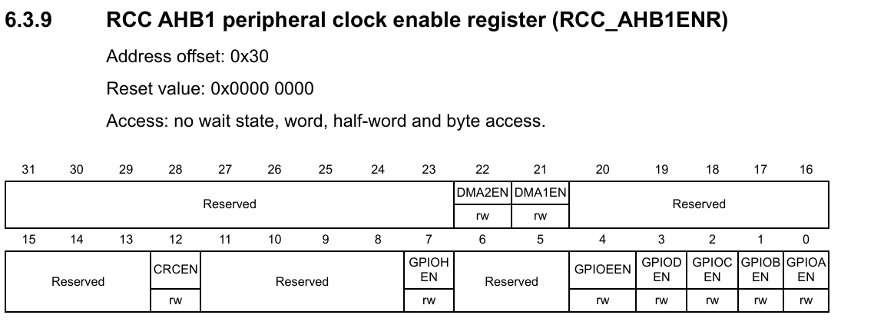
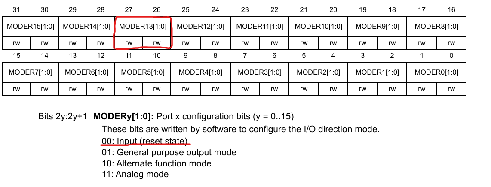
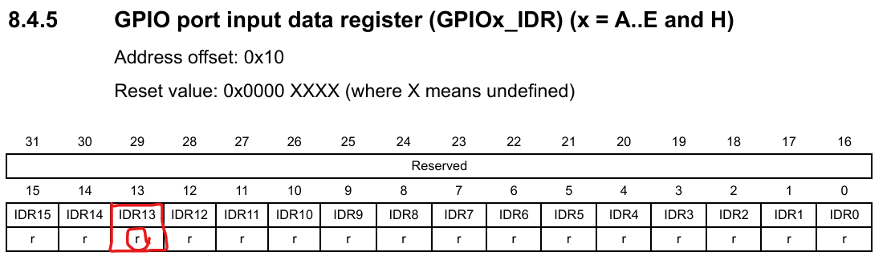
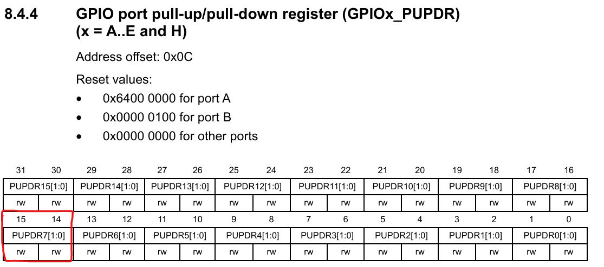

___ 
## 1 코드 가독성 및 반복문 설계 패턴

- 반복 횟수 제어
    - 0부터 N까지 반복 시 `S < N` 조건을 사용하여 직관적인 범위 설정
- While 루프 최적화
    - 무한 루프 후 강제 탈출 대신 `Setup` 조건을 루프 진입 시점에 명확히 정의
- Wait Until 패턴
    - 특정 조건 만족까지 대기 시 `while (!(대기 조건))` 형식 사용
    - 대기 상태의 **부정(NOT)**을 루프 조건으로 설정하여 탈출 시점 관리

## 2 하드웨어 타이밍과 메모리 Latency

- 문제 원인
    - CPU 고속화(16MHz → 96MHz) 시 메모리 응답 속도(Access Timing)가 CPU를 따라가지 못하는 병목 발생
    - CPU가 데이터 수신 전 다음 동작을 수행하여 오류 발생
- 해결책
    - CPU 메모리 접근 시 강제 대기 사이클(Wait State) 삽입
    - 동작 주파수에 맞춰 `Flash ACR` 레지스터 값을 조정하여 Latency 확보

## 3 설정의 선후 관계 (Critical Path)

- 필수 로직 순서
    - 메모리 Latency 설정 (CPU 주파수 변경 전 필수 수행)
    -  CPU 주파수 변경 (Latency 설정 완료 후 반영)
- 주의사항
    - 주파수를 먼저 올릴 경우 설정 코드 자체가 메모리에서 정상적으로 읽히지 않아 시스템 정지(Hang) 발생

## 4 캐시 및 파이프라인 최적화

- 활성화 절차
    - 캐시 초기화(Reset): 기존 잔여 데이터 청소 (`iCacheReset`)
    -  기능 활성화: `iCacheEnable` 및 `PrefetchEnable` 실행
- 목적
    - CPU 파이프라인 효율성 극대화 및 병목 현상 완화

## 5 실무자 조언

- 현장 대응
    - 개발 환경 외 실무 현장의 전압 노이즈 및 온도 변화 고려 필요
- 보수적 설계
    - 최악의 상황(Worst-case)을 상정한 Latency 설정으로 대형 사고 방지

---

- **<span style = "color: orange">AHB1 (GPIOC) CLK Enable</span>**
    
- **<span style="color: orange">PORTC boundary address : 0x4002 0800 - 0x4002 0BFF</span>**
    

- **<span style="color: orange">Input Register (IDR)</span>**
    

---

## 과제

- ```c
	  Macro_Write_Block(GPIOC→PUPDR, 0x3, 0x1, 14);
	```
	
    
    

